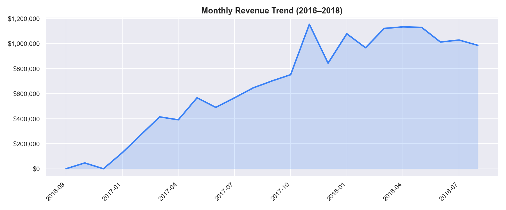
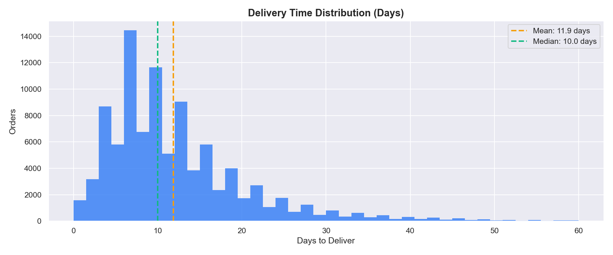
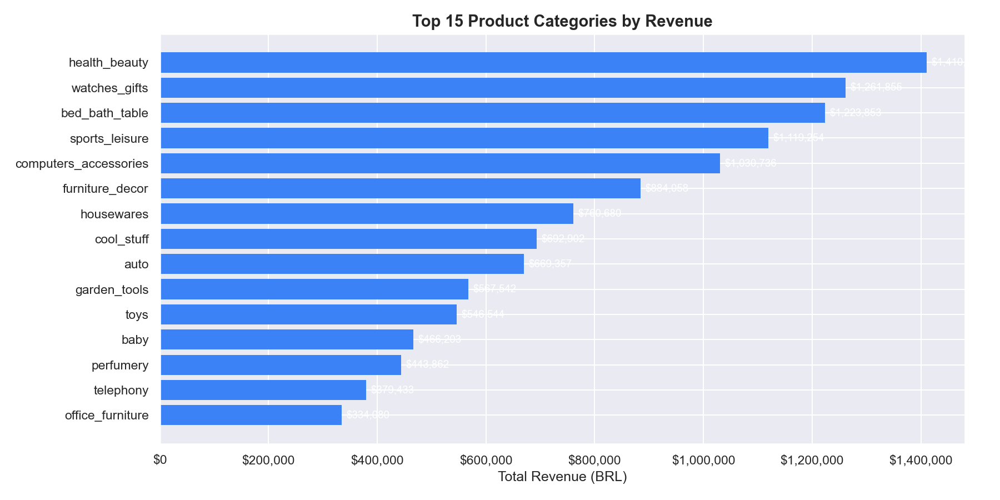

# E-Commerce Operations Analytics
### Olist Brazilian E-Commerce — End-to-End Analytics Project

> Analyzed 99,441 real orders across 3+ years to uncover revenue drivers, delivery bottlenecks, and customer satisfaction patterns — delivering a 3-page interactive Tableau dashboard for operational decision-making.

---

## Business Problem

Olist, Brazil's largest e-commerce marketplace, connects small businesses to major retail channels. Leadership needed visibility into:
- **Which product categories and regions drive the most revenue?**
- **Why are customers leaving low review scores — and how does delivery impact satisfaction?**
- **Which sellers are underperforming on on-time delivery?**
- **What are the peak demand periods and how should inventory be planned?**

---

## Dataset

| Field | Detail |
|-------|--------|
| **Source** | [Kaggle — Olist Brazilian E-Commerce](https://www.kaggle.com/datasets/olistbr/brazilian-ecommerce) |
| **Orders** | 99,441 |
| **Tables** | 9 (orders, customers, products, sellers, payments, reviews, geolocation) |
| **Period** | September 2016 – October 2018 |
| **Format** | CSV (9 files, joined via Python) |

---

## Tools Used

- **Python** (pandas, matplotlib, seaborn) — data cleaning, joining, EDA
- **SQL** (DuckDB) — 15 analytical queries
- **Tableau** — 3-page interactive dashboard (13 charts)
- **Jupyter Notebook** — exploratory analysis
- **Git / GitHub** — version control

---

## Key KPIs

| KPI | Value |
|-----|-------|
| Total Revenue | $15.8M BRL |
| Total Orders | 99,441 |
| Avg Order Value | $154.10 |
| Avg Review Score | 4.09 / 5 |
| On-Time Delivery Rate | 89.1% |
| Avg Delivery Time | 12.5 days |
| Unique Customers | 96,096 |
| Active Sellers | 3,095 |

---

## Process

1. **Data Collection** — Downloaded 9 Olist CSV files from Kaggle
2. **Data Cleaning** — Merged all tables into a single master dataset using Python/pandas; parsed dates, engineered delivery metrics, assigned sentiment labels
3. **SQL Analysis** — 15 queries covering revenue trends, delivery performance, customer segmentation, seller rankings
4. **EDA** — 10 visualizations exploring distributions, trends, and correlations
5. **Dashboard** — 3-page Tableau dashboard with KPI cards, map, trend lines, heatmap, and full interactivity
6. **Insights** — Identified 4 high-impact business recommendations

---

## Key Insights

### 1. Revenue grew 123% from 2017 to 2018
Monthly revenue peaked in November 2017 (Black Friday effect), reaching $1.2M+ in a single month. Q4 consistently outperforms all other quarters.

### 2. Late deliveries tank review scores
Orders delivered on time average **4.3/5 stars**. Late orders average **2.6/5** — a 40% drop. This directly impacts repeat purchase rates and seller reputation.

### 3. São Paulo dominates — but opportunity lies in underserved states
SP generates 42% of all revenue but has above-average delivery times (13.5 days). States like AM and RR have <75% on-time delivery rates — a major fulfillment gap.

### 4. Credit cards drive 74% of revenue
Credit card is the dominant payment method. Average installments = 3.7, suggesting customers prefer splitting payments — an opportunity for "buy now, pay later" promotions.

### 5. Health & Beauty is the top category by orders
But `bed_bath_table` and `computers_accessories` generate the most revenue per order ($200+ avg), making them high-value targets for marketing investment.

---

## Dashboard Preview

> **[View Interactive Dashboard on Tableau Public](https://public.tableau.com/app/profile/nikhil.parvatapuram/viz/E-commerceOperationsAnalytics/ExecutiveOverview)**

**Dashboard 1: Executive Overview**


**Dashboard 2: Delivery & Operations**


**Dashboard 3: Products & Sellers**


---

## How to Run

```bash
# 1. Clone the repo
git clone https://github.com/Nikhil-leo/ecommerce-operations-analytics.git
cd ecommerce-operations-analytics

# 2. Install dependencies
pip install pandas matplotlib seaborn jupyter

# 3. Download dataset from Kaggle → place CSVs in data/raw/
# https://www.kaggle.com/datasets/olistbr/brazilian-ecommerce

# 4. Clean and merge data
python src/clean_data.py

# 5. Generate EDA charts
python src/eda.py

# 6. Open analysis notebook
jupyter notebook notebooks/analysis.ipynb

# 7. Run SQL queries (install DuckDB first: pip install duckdb)
duckdb -c ".read sql/analysis.sql"

# 8. Open Tableau → connect to data/cleaned/master.csv
# Follow: tableau/dashboard-build-guide.md
```

---

## Files

```
data/raw/               → 9 original Olist CSV files
data/cleaned/           → master.csv, individual tables, kpi_summary.csv
notebooks/              → Jupyter EDA notebook
sql/analysis.sql        → 15 SQL queries
src/clean_data.py       → Data cleaning + merging pipeline
src/eda.py              → EDA chart generation
tableau/                → Tableau workbook + build guide
assets/                 → 10 EDA charts
README.md               → This file
case-study.md           → Full written case study
```

---

## Business Recommendations

1. **Cap delivery SLA at 10 days** — orders delivered in ≤10 days score 4.5+ stars vs 2.8 for 20+ day deliveries. Negotiate faster carrier contracts in the North/Northeast regions.

2. **Prioritize SP, RJ, MG for marketing** — these 3 states represent 65% of revenue. Targeted promotions during Q4 would amplify the existing seasonality spike.

3. **Flag high-freight categories** — `office_furniture` and `housewares` have freight costs exceeding 35% of product price, eroding margins. Renegotiate carrier rates or add freight surcharges.

4. **Implement seller performance tiers** — the top 100 sellers generate 40% of revenue. A tiered incentive program (faster payouts, promotional placement) would reward reliability and reduce churn risk.

---

*Built by [Nikhil P](https://www.linkedin.com/in/nikhil0180-data-analyst/) · [GitHub](https://github.com/Nikhil-leo) · [Tableau Public](https://public.tableau.com/app/profile/nikhil.parvatapuram/vizzes)*
