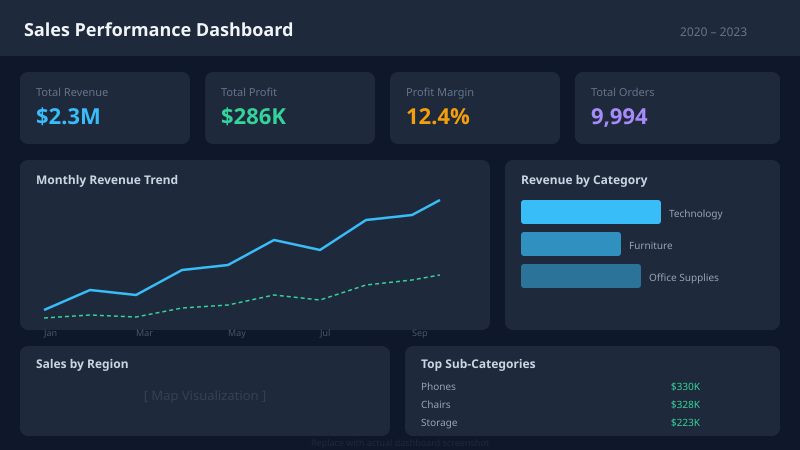

# Sales Performance Analysis

> Analyzing 4 years of retail sales data to identify revenue drivers, seasonal patterns, and underperforming regions.

---

## Business Problem

A retail company wants to understand what's driving revenue, which regions are underperforming, and how discounting affects profitability — all in an interactive dashboard accessible to non-technical stakeholders.

---

## Dataset

| Field | Details |
|-------|---------|
| **Source** | Kaggle — Superstore Sales Dataset |
| **Size** | ~10,000 rows |
| **Time Period** | 2020–2023 |
| **Format** | CSV |

---

## Tools Used

- Python (pandas, matplotlib, seaborn)
- SQL (DuckDB / PostgreSQL)
- Tableau
- Power BI
- Jupyter Notebooks

---

## Process

1. **Data Collection** — Downloaded Superstore dataset from Kaggle
2. **Data Cleaning** — Removed duplicates, fixed date types, handled nulls
3. **Exploratory Analysis** — Identified top categories, seasonal trends, regional gaps
4. **Dashboard Design** — Built KPI cards, bar charts, map, and line trend views
5. **Insights & Recommendations** — Summarized findings for stakeholder presentation

---

## Key Insights

- Q4 generates 30% more revenue than any other quarter — inventory planning should reflect this
- Technology category has the highest profit margin (32%), while Furniture is the lowest (8%)
- Discounts above 20% consistently result in negative profit margins

---

## Dashboard Preview

> **Tableau:** [View on Tableau Public](https://public.tableau.com/views/your-workbook)
> **Power BI:** [View Report](https://app.powerbi.com/view?r=your-report-id)



---

## How to Run

```bash
# 1. Clone the repository
git clone https://github.com/yourusername/sample-sales-analysis.git
cd sample-sales-analysis

# 2. Install dependencies
pip install -r ../../requirements.txt

# 3. Download the Superstore dataset and place it in data/raw/raw_data.csv

# 4. Clean the data
python src/clean_data.py

# 5. Open the analysis notebook
jupyter notebook notebooks/analysis.ipynb

# 6. Run SQL queries
# Open sql/analysis.sql in DuckDB or your preferred SQL tool
```

---

## Files Included

```
/data/raw          → Raw dataset (add your CSV here)
/data/cleaned      → Cleaned dataset (generated by src/clean_data.py)
/notebooks         → Jupyter notebook for EDA
/sql               → SQL analysis queries
/src               → Python cleaning script
/tableau           → Tableau workbook files (.twbx)
/powerbi           → Power BI report files (.pbix)
/assets            → Dashboard screenshots
README.md          → This file
case-study.md      → Full written case study
dashboard-docs.md  → Dashboard KPIs, charts, and publishing instructions
```

---

## Final Recommendation

Prioritize Technology category promotions in Q4, cap discounts at 15% organization-wide, and build a regional alert system to flag underperforming territories in real time.

---

*Built by Your Name · 2025*
